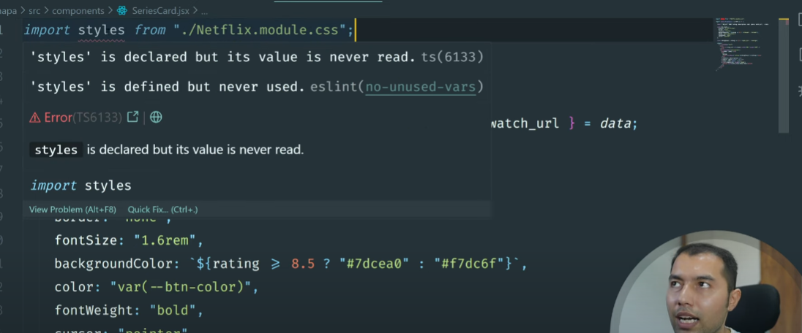
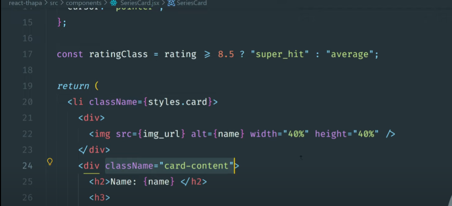
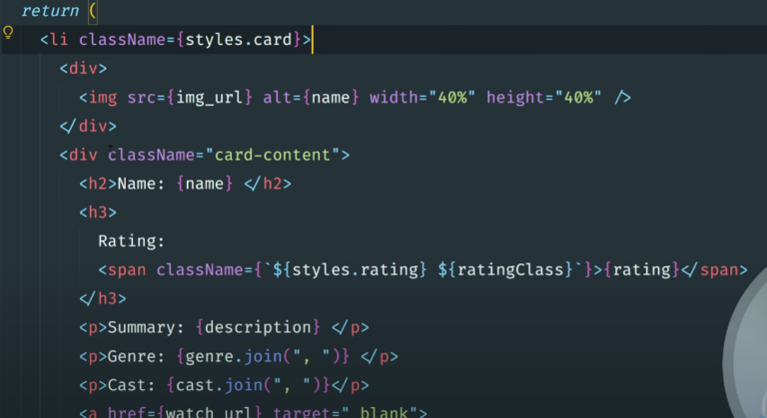

Jsx : all tage must be closed 
```

```
and all child must have one parente it return only one parent 
```
<h1>hello wolrd</h1>
React.createElement('h1',null,"Hello Wolrd"); 
```


- Named Export :-  je name this export karyu hoy te j name thi import karavu pade and  {} use karvu pade ama jo {} na vagar use kariye to tene default valu j samje

- Default export :- ek file ma ekj var use kari     sakay name ma koy constraint nathi
                   
-    Mix export :-  import practice,{App} from './App.jsx'

-   Default Export: A file can have only one    default export.
- Default Import: When importing a default export, you can name the
import whatever you like.

- Named Export:
A file can have multiple named exports.
Each named export must be explicitly exported.
- Named Import:
When importing named exports, the import names must match
export names exactly.
Named imports must be enclosed in curly braces.

- Practice file have interview questions 
    ```jsx
    <p>{students.length && "No students found"}</p> 
    <p>Number of students: {students.length}</p> 
    ```
- Profile file has another Question pasing jsx as props and for numeric {} - Children

    ```react
    <Profile> 
        <h1>hello</h1>
        <p> how are you?</p>
    <profile/>      
    ```             
- Style modules in css
  - Global CSS like index.css that we can use in any component but if we have some specific style  which is specific for some specific component then use name.module.css
  - Name your CSS module files with the .module.css or .module.scss extension.
  - Import the CSS module file in your React component.
  - Access class names as properties of the imported <b style='color: orange'>styles object</b>.
  - Combine multiple class names using template literals or the class
library.
Dynamically apply class names based on component state and props

- 

- 

- 